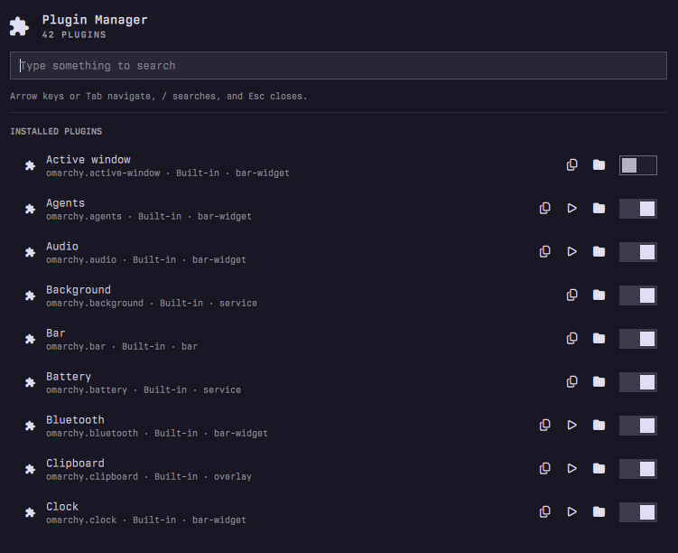

# Omarchy Plugin Manager



Browse and manage installed Omarchy shell plugins from one bar panel.

## Features

- Browse built-in and third-party plugins
- Search by plugin name or ID
- Enable, disable, clone, and remove plugins
- Open plugin interfaces and source directories
- Rescan the plugin registry

## Requirements

- Omarchy with the Quattro plugin runtime
- `xdg-open` for opening plugin directories
- `omarchy-launch-config-editor` for editing plugin source directories

The plugin runs inside the existing `omarchy-shell` process. It does not start
services, make network requests, require elevated privileges, or overwrite user
configuration. Plugin actions use Omarchy's native `omarchy-plugin-*` commands.

## Install

```sh
omarchy plugin add https://github.com/peterszarvas94/omarchy-plugin-manager.git --enable
omarchy bar move io.github.peterszarvas94.plugin-manager --section right
```

If necessary, rescan the plugin registry:

```sh
omarchy-shell shell rescanPlugins
```

## Usage

Click the bar icon or summon the manager through shell IPC:

```sh
omarchy-shell shell summon io.github.peterszarvas94.plugin-manager '{}'
```

Use the search field to filter plugins. Arrow keys and Tab navigate; `/` focuses
the search field; Escape closes the panel.

### Optional Shortcut

Add this to `~/.config/hypr/bindings.lua`:

```lua
o.bind("SUPER + CTRL + SHIFT + M", "Plugin Manager", "omarchy-shell shell summon io.github.peterszarvas94.plugin-manager '{}'")
```

The plugin does not install or overwrite keybindings automatically.

## Remove

```sh
omarchy plugin disable io.github.peterszarvas94.plugin-manager
omarchy plugin remove io.github.peterszarvas94.plugin-manager
```

## License

MIT. See [LICENSE](LICENSE).
